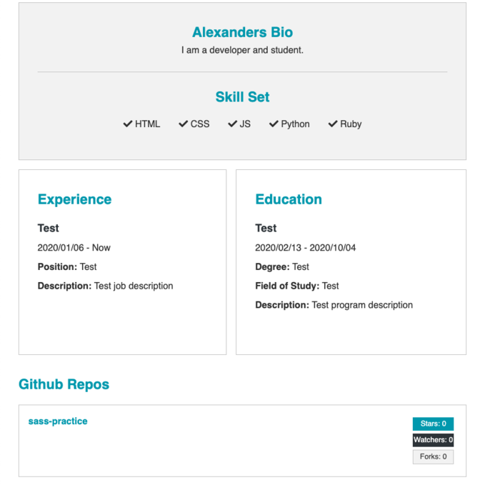

# DevConnector

[DevConnector Website](https://github.com/alxndryn/dev-connector)

## Overview

DevConnector is a basic social media platform for developers. Users are able to register to the site, create a profile, and write posts and comments. The profile page includes the 
ability to fill out basic information about yourself such as your job experience and education. Additionally, user profiles can link to various social media websites they may have
such as Twitter, LinkedIn, and Facebook. Users can view their profile info on the dashboard page. The developers page displays every user registered to the website.

## Built With

- [React](https://reactjs.org/) - Front-end JavaScript library
- [React Redux](https://react-redux.js.org/) - React state management
- [Express](https://expressjs.com/) - Web framework
- [node.js](https://nodejs.org/en/) - Back-end JavaScript runtime environment
- [mongoDB](https://www.mongodb.com/) - Document-based database
- [Sass](https://sass-lang.com/) - CSS extension language
- [Postman](https://www.postman.com/) - Platform for API development
- [GitHub REST API](https://docs.github.com/en/free-pro-team@latest/rest) - Make calls to integrate data with GitHub
- [Moment.js](https://momentjs.com/) - Parse, validate, manipulate,and display dates and times in JavaScript

## Future Development

- Have user profile display pinned repositories instead of latest
- Add Google OAuth for registering to the site

## Screenshots

## Note

This project was created from Brad Traversy's Udemy course, MERN Stack Front To Back: Full Stack React, Redux & Node.js.

- [Brad's DevConnector repo](https://github.com/bradtraversy/devconnector_2.0)
- [Link to Udemy course](https://www.udemy.com/course/mern-stack-front-to-back/)
